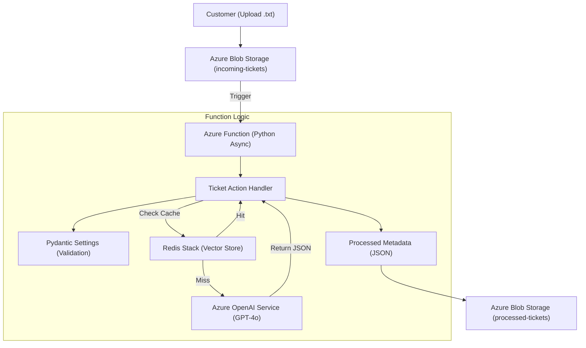

# 🚀 Enterprise Customer Incident Router (Azure AI & Redis)

An automated, event-driven, and scalable backend pipeline for processing customer support tickets using **Azure OpenAI Service**, **Azure Functions**, and **Redis Vector Similarity Search** for semantic caching.

---

## 🏗️ Architecture

This project follows the **Action Handler** design pattern to separate business logic from cloud infrastructure.



---

## ✨ Key Features

*   **Event-Driven Trigger**: Automatically reacts to file uploads in real-time.
*   **Asynchronous I/O**: High-performance Python `asyncio` logic capable of handling many concurrent tickets.
*   **Semantic Caching (Vector Search)**: Uses **RedisVL** to identify semantically similar tickets, returning cached results in milliseconds and saving on LLM costs.
*   **Structured AI Outputs**: Uses **Pydantic** and OpenAI's **Structured Outputs (JSON Schema)** to guarantee the model returns valid data every single time.
*   **Production Patterns**: 
    *   **Action Handler Pattern** for clean decoupling.
    *   **Exponential Backoff Retries** via `tenacity`.
    *   **Defensive Truncation** for large log files.
    *   **Strict Environment Validation** via `pydantic-settings`.

---

## 🛠️ Setup & Local Development

### 1. Prerequisites
*   [Python 3.10+](https://www.python.org/downloads/)
*   [Azure Functions Core Tools](https://learn.microsoft.com/en-us/azure/azure-functions/functions-run-local)
*   [Docker](https://www.docker.com/) (for local Redis Stack)
*   [Azurite](https://github.com/Azure/Azurite) (Local Storage Emulator)

### 2. Configure Environment
1. Copy `src/local.settings.json.example` to `src/local.settings.json`.
2. Provide your **Azure OpenAI Endpoint** and **API Key**.

### 3. Start Local Services
Open three separate terminal windows:

**Terminal 1: Storage Emulator**
```bash
azurite --silent --location ~/.azurite --skipApiVersionCheck
```

**Terminal 2: Redis Stack (Vector Database)**
```bash
docker run -p 6379:6379 redis/redis-stack:latest
```

**Terminal 3: Azure Function**
```bash
cd src
python -m venv .venv
source .venv/bin/activate
pip install -r requirements.txt
func start
```

---

## 🧪 Testing the Pipeline

Use the provided test scripts to simulate the end-to-end flow without needing the Azure Portal.

1.  **Upload a Ticket**:
    ```bash
    python tests/local_test_upload.py
    ```
    *First run: Results in a **Cache MISS**.*
    *Second run: Results in a **Cache HIT** (Instant).*

2.  **View the Results**:
    ```bash
    python tests/local_test_view_result.py
    ```

---

## 📂 Project Structure

```text
├── sample_tickets/         # Mock data for testing
├── src/                    # Core Application
│   ├── config.py           # Environment validation (Pydantic Settings)
│   ├── function_app.py     # Skinny trigger entrypoint
│   ├── handlers.py         # Business Logic coordinator (Action Handler)
│   ├── host.json           # Azure host configuration
│   ├── local.settings.json # Local secrets (GIT IGNORED)
│   ├── models.py           # Domain models (Pydantic)
│   ├── redis_cache.py      # Semantic Caching service (RedisVL)
│   ├── requirements.txt    # Python dependencies
│   ├── services.py         # AI service logic
│   └── prompts.py          # LLM System Prompts
└── tests/                  # Local developer utility scripts
```

---
