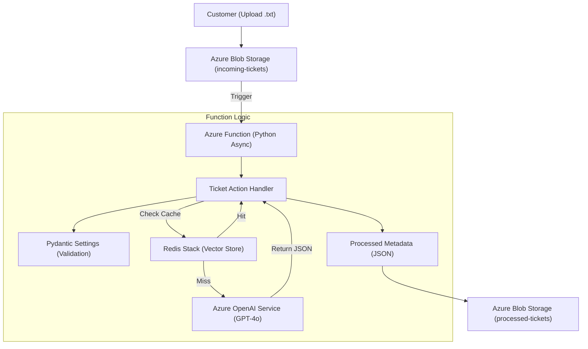

## 🏗️ Architecture

This project follows the **Action Handler** design pattern to separate business logic from cloud infrastructure.

```mermaid
graph TD
    User["Customer (Upload .txt)"] --> Blob["Azure Blob Storage (incoming-tickets)"]
    Blob -- "Trigger" --> AF["Azure Function (Python Async)"]
    
    subgraph "Function Logic"
        AF --> Handler["Ticket Action Handler"]
        Handler --> Config["Pydantic Settings (Validation)"]
        Handler -- "Check Cache" --> Redis["Redis Stack (Vector Store)"]
        
        Redis -- "Miss" --> AI["Azure OpenAI Service (GPT-4o)"]
        AI -- "Return JSON" --> Handler
        
        Redis -- "Hit" --> Handler
        Handler --> Out["Processed Metadata (JSON)"]
    end
    
    Out --> Result["Azure Blob Storage (processed-tickets)"]
```

---

---
